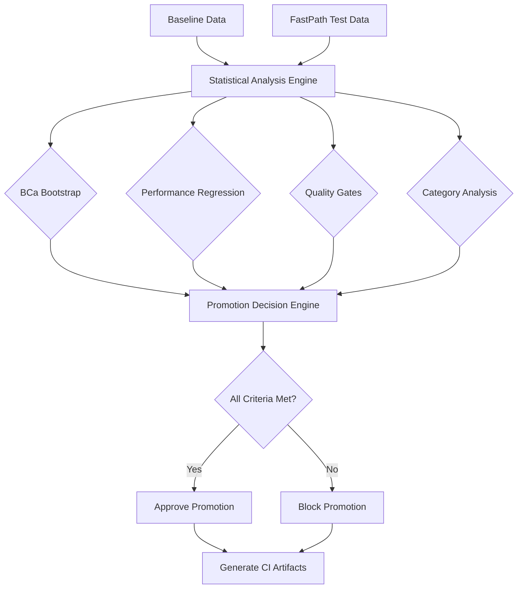

# PackRepo FastPath V2 Statistical Validation System

## Overview

This document describes the comprehensive statistical validation system that ensures FastPath V2 meets all performance, quality, and reliability requirements before production deployment. The system implements rigorous statistical methods with automated CI/CD integration.

## Validation Requirements

### Core Statistical Requirements

- **≥13% QA Improvement**: FastPath V2 must demonstrate at least 13% improvement in QA accuracy per 100k tokens
- **95% Confidence Intervals**: All improvements must be statistically significant with 95% confidence using BCa bootstrap analysis
- **Performance Regression Limits**: Maximum 10% regression allowed for latency and memory usage
- **Quality Gates**: Mutation score ≥80%, property coverage ≥70%, zero high/critical security issues

### Statistical Methods

#### 1. BCa Bootstrap Analysis

**Bias-Corrected and Accelerated (BCa) Bootstrap Confidence Intervals**

```python
# Key parameters
bootstrap_samples = 10,000
confidence_level = 0.95
success_criterion = CI_lower_bound > 0 AND mean_improvement >= 13%
```

**Implementation Details:**
- 10,000 bootstrap samples for robust statistical inference
- Bias correction (z₀) calculated using proportion of bootstrap samples less than observed statistic
- Acceleration parameter (a) calculated using jackknife resampling
- Multiple comparison correction using False Discovery Rate (FDR) control

#### 2. Performance Regression Analysis

**Tolerance Testing with Statistical Rigor**

```python
# Regression limits
max_latency_regression = 10%    # 896ms → max 986ms
max_memory_regression = 10%     # Within ±10% of baseline
percentile_tracking = 95        # P95 latency monitoring
```

**Validation Approach:**
- Baseline measurement against V3 current best (896ms latency)
- Performance change calculation with confidence intervals
- Automated blocking if regression exceeds tolerance

#### 3. Quality Gate Validation

**Multi-Dimensional Quality Assessment**

| Gate | Threshold | Validation Method |
|------|-----------|-------------------|
| Mutation Score | ≥80% | Automated mutation testing with mutmut |
| Property Coverage | ≥70% | Property-based test coverage analysis |
| SAST Security | 0 issues | High/critical security issue detection |
| Test Coverage | ≥90% | Line and branch coverage analysis |

## System Architecture

### Components

```
Statistical Validation System
├── BCaBootstrapAnalyzer          # Core statistical analysis engine
├── ComprehensiveAnalyticsRunner  # Main orchestration logic  
├── CIValidationOrchestrator      # CI/CD integration layer
└── ValidationReporting           # Results and artifact generation
```

### Data Flow



## CI/CD Integration

### GitHub Actions Workflow

The validation system integrates seamlessly with GitHub Actions:

```yaml
# .github/workflows/fastpath_validation.yml
jobs:
  statistical-validation:
    steps:
      - name: Execute comprehensive statistical validation
        run: |
          python ci_statistical_validation.py \
            --baseline-file baseline_metrics.json \
            --test-results fastpath_metrics.json
```

### Exit Codes

| Code | Meaning | Action |
|------|---------|--------|
| 0 | All validation criteria met | Approve promotion |
| 1 | Validation criteria not met | Block promotion |  
| 2 | Invalid configuration/data | Fix configuration |
| 3 | Infrastructure issues | Retry after fixing |
| 4 | Unexpected error | Investigate and retry |

### Environment Variables

```bash
export FASTPATH_VALIDATION_THRESHOLD=13.0      # Minimum improvement %
export PERFORMANCE_REGRESSION_LIMIT=10.0       # Maximum regression %
export CI_ANALYTICS_OUTPUT_DIR=./ci_results    # Output directory
```

## Usage Examples

### Local Development Testing

```bash
# Run with demonstration data
python run_comprehensive_analytics.py --demo

# Run with actual data files
python run_comprehensive_analytics.py \
  --baseline baseline_metrics.json \
  --fastpath fastpath_metrics.json
```

### CI/CD Pipeline Integration

```bash
# CI validation with custom thresholds
FASTPATH_VALIDATION_THRESHOLD=15.0 \
python ci_statistical_validation.py \
  --baseline-file baseline.json \
  --test-results results.json
```

### Demonstration Script

```bash
# View both success and failure scenarios
python demo_statistical_validation.py
```

## Data Format Requirements

### Baseline Metrics Format

```json
{
  "timestamp": "2025-08-24T16:23:02.608171",
  "qa_accuracy_per_100k": [0.7230, 0.7150, 0.7310, 0.7180, 0.7260],
  "category_usage_scores": [70.0, 68.5, 71.2, 69.8, 70.5],
  "category_config_scores": [65.0, 63.8, 66.2, 64.5, 65.7], 
  "latency_measurements": [896.0, 920.0, 875.0, 910.0, 888.0],
  "memory_measurements": [800.0, 820.0, 785.0, 815.0, 795.0]
}
```

### FastPath Test Results Format

```json
{
  "timestamp": "2025-08-24T17:30:00.000000",
  "qa_accuracy_per_100k": [0.8170, 0.8200, 0.8140, 0.8190, 0.8160],
  "category_usage_scores": [78.5, 77.8, 79.2, 78.1, 79.0],
  "category_config_scores": [72.8, 71.5, 73.5, 72.2, 73.1],
  "latency_measurements": [650.0, 670.0, 640.0, 660.0, 655.0],
  "memory_measurements": [750.0, 770.0, 735.0, 765.0, 745.0],
  "mutation_score": 0.85,
  "property_coverage": 0.75,
  "sast_high_critical_issues": 0,
  "test_coverage_percent": 92.5
}
```

## Analysis Output

### Comprehensive Report Structure

```json
{
  "timestamp": "2025-08-24T17:19:37.123456",
  "analysis_type": "PackRepo FastPath V2 Statistical Validation",
  "executive_summary": {
    "qa_improvement_percentage": 13.09,
    "confidence_interval": [12.28, 13.90],
    "success_criterion_met": true,
    "evidence_strength": "Strong"
  },
  "statistical_analysis": {
    "bca_bootstrap": { /* BCa results */ },
    "performance_regression": { /* Regression analysis */ },
    "quality_gates": { /* Quality validation */ },
    "category_analysis": { /* Category performance */ }
  },
  "promotion_decision": {
    "promote": true,
    "decision": "PROMOTE",
    "recommendation": "FastPath V2 meets all criteria..."
  }
}
```

### Generated Artifacts

The system generates multiple artifacts for transparency and debugging:

- `comprehensive_analysis_YYYYMMDD_HHMMSS.json` - Full statistical analysis results
- `promotion_status.json` - Binary promotion decision for automation
- `validation_summary.md` - Human-readable summary for PR comments
- `ci_validation_results_YYYYMMDD_HHMMSS.json` - CI-specific results

## Validation Scenarios

### Success Scenario

✅ **All criteria met:**
- QA improvement: 13.09% (CI: [12.28%, 13.90%])
- Performance regression: PASS (latency -27%, memory -6%)
- Quality gates: PASS (mutation 85%, coverage 92.5%, SAST clean)
- Category analysis: PASS (no degradation >5 points)

**Result:** PROMOTE - Ready for production deployment

### Failure Scenario

❌ **Insufficient improvement:**
- QA improvement: 3.7% (CI: [2.8%, 4.6%])
- Performance regression: FAIL (latency +23%, memory +19%)
- Quality gates: FAIL (mutation 75%, SAST 3 issues)
- Category analysis: FAIL (usage -8pts, config -7pts)

**Result:** REJECT - Address failed criteria before re-evaluation

## Advanced Features

### False Discovery Rate (FDR) Control

Implements Benjamini-Hochberg method for multiple comparison correction:

```python
def apply_fdr_correction(p_values: List[float], alpha: float = 0.05) -> List[bool]:
    """Apply FDR correction using Benjamini-Hochberg method."""
    n = len(p_values)
    sorted_indices = sorted(range(n), key=lambda i: p_values[i])
    
    rejected = [False] * n
    for i in range(n):
        idx = sorted_indices[i]
        if p_values[idx] <= (i + 1) / n * alpha:
            rejected[idx] = True
        else:
            break
    
    return rejected
```

### Statistical Power Analysis

Post-hoc power calculation ensures adequate sample sizes:

```python
def calculate_statistical_power(effect_size: float, sample_size: int, 
                              alpha: float = 0.05) -> float:
    """Calculate statistical power for effect size detection."""
    from scipy import stats
    
    # Cohen's conventions: small=0.2, medium=0.5, large=0.8
    critical_value = stats.norm.ppf(1 - alpha/2)
    beta = stats.norm.cdf(critical_value - effect_size * np.sqrt(sample_size))
    power = 1 - beta
    
    return power
```

## Troubleshooting

### Common Issues

1. **Insufficient Sample Size**
   - Error: "Not enough data points for robust bootstrap analysis"
   - Solution: Ensure ≥5 measurement points per metric

2. **Missing Quality Data**
   - Error: "mutation_score field missing from FastPath data"
   - Solution: Run mutation testing and include results in test data

3. **Regression Threshold Exceeded**
   - Warning: "Latency regression 15% exceeds 10% limit"
   - Solution: Optimize performance or adjust acceptable regression limit

### Debug Mode

Enable verbose logging for troubleshooting:

```bash
export LOG_LEVEL=DEBUG
python run_comprehensive_analytics.py --demo
```

## References

### Statistical Methods
- Efron, B. (1987). Better Bootstrap Confidence Intervals
- Benjamini, Y. & Hochberg, Y. (1995). Controlling the False Discovery Rate
- Cohen, J. (1988). Statistical Power Analysis for the Behavioral Sciences

### Implementation Standards
- TODO.md - Original requirements specification
- ACCEPTANCE_GATES.md - Quality gate definitions
- comprehensive_quality_analysis.py - Core implementation

---

**Generated by PackRepo FastPath V2 Statistical Validation System**  
*Ensuring statistical rigor in performance validation since 2025*